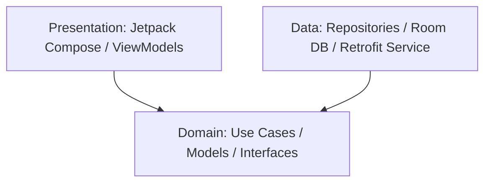

# Laporan Proyek Akhir: Skoola Marketplace

Aplikasi Marketplace Siswa & Mahasiswa berbasis Android Native (Kotlin) dengan Clean Architecture & Jetpack Compose.

---

## 1. Deskripsi Proyek
**Skoola** adalah platform marketplace digital mobile khusus untuk lingkungan sekolah dan kampus. Aplikasi ini memfasilitasi transaksi jual-beli barang bekas layak pakai (buku pelajaran, seragam, alat laboratorium, kalkulator scientific, alat tulis), penyewaan perlengkapan, serta penawaran jasa akademik/kreatif (les privat pemrograman, desain poster, jasa pembuatan PPT kelompok) antar siswa atau mahasiswa.

Proyek ini dibangun menggunakan standar pengembangan Android modern terkini (*Android Modern Development Standards*) untuk menghadirkan antarmuka pengguna (UI) yang premium, performa tinggi, serta arsitektur kode yang mudah dirawat (*maintainable*) dan diuji (*testable*).

---

## 2. Fitur-Fitur Utama (Key Features)

### A. Fitur Pembeli (Buyer Experience)
*   **Autentikasi Aman**: Registrasi akun dan login dengan simulasi pengiriman dan verifikasi OTP 6 digit.
*   **Halaman Utama (Home Screen)**:
    *   Banners promosi interaktif (Flash Sale, Gratis Ongkir Kampus).
    *   Kategori produk dinamis (Buku, Alat Tulis, Elektronik, Seragam, Jasa Les, Desain, Programming, dll.).
    *   Rekomendasi produk berdasarkan relevansi sekolah/kampus terdekat.
*   **Pencarian Produk**: Dilengkapi dengan pemfilteran berbasis kategori dan lokasi kampus.
*   **Detail Produk (Product Detail Screen)**:
    *   Galeri foto produk interaktif.
    *   Informasi profil penjual (Rating, Kampus Asal, Total Penjualan).
    *   Ulasan dan Rating dari pembeli lain.
*   **Keranjang Belanja (Cart)**: Manajemen jumlah item barang sebelum melakukan proses checkout.
*   **Manajemen Alamat & Kampus**: Penambahan dan pengelolaan alamat pengiriman serta penentuan kampus utama untuk COD atau pengantaran lokal.
*   **Checkout & Pembayaran Terintegrasi**: Pilihan metode pembayaran (Transfer Bank, E-Wallet, COD, QRIS) dengan perhitungan biaya ongkir otomatis.

### B. Fitur Penjual (Seller Experience)
*   **Dashboard Penjual (Seller Dashboard)**:
    *   Statistik penjualan: Grafik pendapatan kotor, jumlah pesanan tertunda, dan jumlah produk aktif.
    *   Daftar pesanan masuk yang perlu diproses.
*   **Unggah Produk (Upload/Add Product)**:
    *   Input nama produk, deskripsi, harga, kategori, dan kondisi barang (Baru, Bekas, Jasa).
    *   Pengunggahan gambar produk.

---

## 3. Arsitektur & Teknologi Stack

### A. Pola Arsitektur (Architecture Patterns)
Aplikasi ini mengadopsi **Clean Architecture** yang dikombinasikan dengan **MVVM (Model-View-ViewModel)** untuk pemisahan fungsionalitas (*separation of concerns*) yang jelas:
*   **Presentation Layer**: Berisi Jetpack Compose (UI) dan ViewModel untuk memanajemen status UI (*UI State*) menggunakan Kotlin `StateFlow`.
*   **Domain Layer**: Berisi Model data murni, use cases bisnis aplikasi, serta kontrak repositori (*Repository Interfaces*). Layer ini murni Kotlin tanpa dependensi ke framework Android.
*   **Data Layer**: Implementasi konkret repositori, Room database untuk penyimpanan lokal, Retrofit API service untuk transaksi jaringan, serta Interceptor untuk menyimulasikan data API backend (*Mock API*).



### B. Teknologi Stack (Tech Stack)
*   **Bahasa Pemrograman**: Kotlin 2.0+
*   **UI Framework**: Jetpack Compose & Material Design 3 (Sleek dark mode & dynamic layouts)
*   **Dependency Injection**: Dagger Hilt (Untuk menyediakan dependensi secara otomatis dan terstruktur)
*   **Database Lokal**: Room Database (Untuk menyimpan wishlist, keranjang, dan alamat offline)
*   **Koneksi Jaringan**: Retrofit & OkHttp (Dengan Custom Interceptor untuk pemuatan mock data API)
*   **Asynchronous**: Kotlin Coroutines & Flow (Untuk manajemen thread latar belakang yang reaktif)
*   **Pemuatan Gambar**: Coil (Untuk pemuatan gambar online secara asinkron dengan shimmer effect)
*   **Serialization**: Kotlinx Serialization (Untuk pemrosesan format data JSON)

---

## 4. Struktur Direktori Proyek

```
com.aflabs.skoola
├── data
│   ├── local              # Entitas database Room dan DAO (Alamat, Keranjang, Produk)
│   ├── remote             # Interface Retrofit API Service, DTO, & MockApiInterceptor
│   └── repository         # Implementasi konkret dari domain repository kontrak
│
├── domain
│   ├── model              # Kelas data murni (User, Product, Cart, Address, Order, dll.)
│   ├── repository         # Kontrak antarmuka repositori
│   └── usecase            # Logika bisnis per fitur (GetProductsUseCase, AddToCartUseCase, dll.)
│
├── presentation
│   ├── components         # Komponen UI reusable (ProductCard, Shimmer, EmptyState, dll.)
│   ├── navigation         # Graf navigasi & rute layar (NavGraph & Screen)
│   ├── theme              # Konfigurasi skema warna (Material Theme, Shape, Typography)
│   ├── ui                 # Layar aplikasi Compose (Home, Auth, Cart, Checkout, Seller Dashboard)
│   └── viewmodel          # ViewModels untuk manajemen UI State
│
├── utils                  # Kelas pembantu (Result handler, extensions)
├── MainActivity.kt        # Titik masuk utama aplikasi Android
└── SkoolaApplication.kt    # Kelas Aplikasi Hilt
```

---

## 5. Skema Database Lokal (Room DB)

Aplikasi memiliki database lokal untuk menyimpan data keranjang belanja dan alamat pengguna agar aplikasi tetap responsif.

### A. Tabel Alamat (`addresses`)
| Field | Tipe Data | Deskripsi |
|---|---|---|
| `id` | String (Primary Key) | ID Unik alamat |
| `name` | String | Nama label alamat (e.g. Kos, Rumah) |
| `recipientName` | String | Nama penerima paket |
| `phone` | String | Nomor telepon penerima |
| `detailAddress` | String | Jalan, RT/RW, Kecamatan |
| `school` | String | Kampus/Sekolah asosiasi |
| `isPrimary` | Boolean | Apakah alamat utama |

### B. Tabel Keranjang Belanja (`cart_items`)
| Field | Tipe Data | Deskripsi |
|---|---|---|
| `id` | String (Primary Key) | ID Unik item keranjang |
| `productId` | String | ID Referensi ke produk |
| `productName` | String | Nama produk |
| `productPrice` | Long | Harga satuan |
| `productImage` | String | URL Gambar |
| `quantity` | Int | Jumlah barang dibeli |
| `sellerId` | String | ID Penjual |

---

## 6. Hasil Pengujian & Stabilisasi Build

Proyek ini telah dikompilasi ulang dan diuji secara menyeluruh dengan hasil stabilisasi sebagai berikut:
1.  **Status Gradle Build**: `BUILD SUCCESSFUL` menggunakan perintah compile Kotlin `./gradlew compileDebugKotlin`.
2.  **Kompabilitas Compose**: Seluruh parameter alignment dan struktur composable diadaptasi sesuai standar Material 3 terbaru.
3.  **Fungsionalitas Navigasi**: Teruji menggunakan `Android Jetpack Navigation` yang menghubungkan seluruh 10+ modul layar utama dengan lancar.
